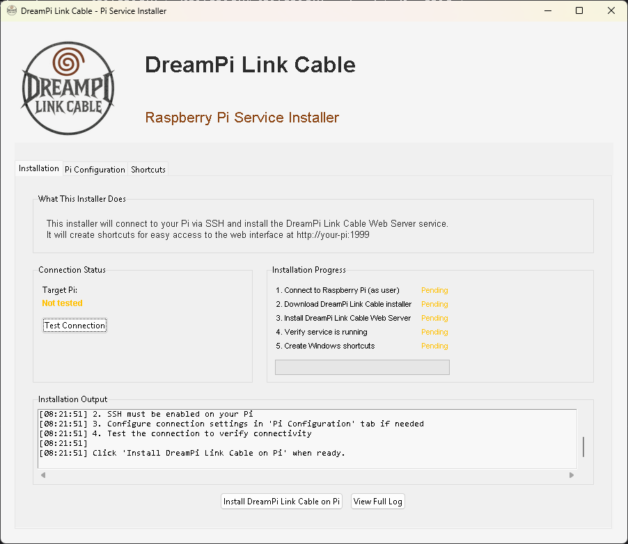
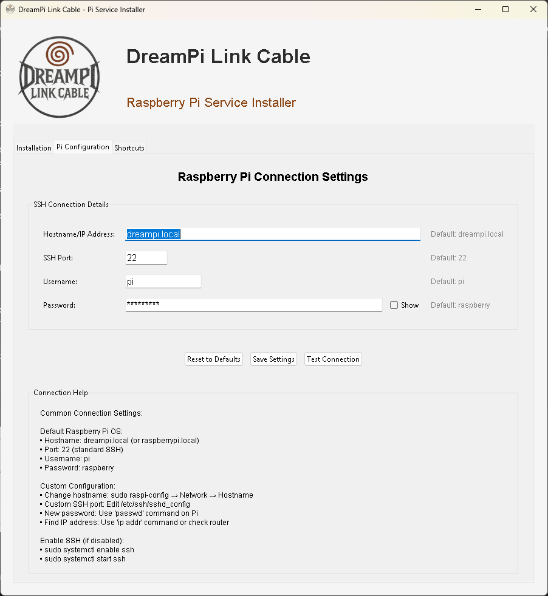
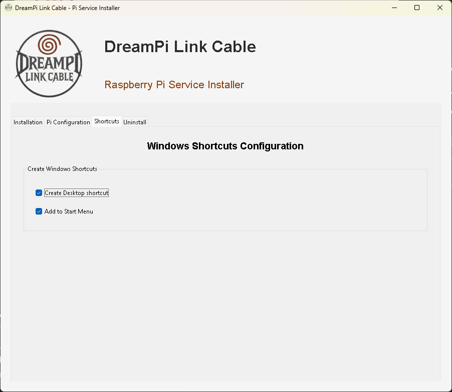
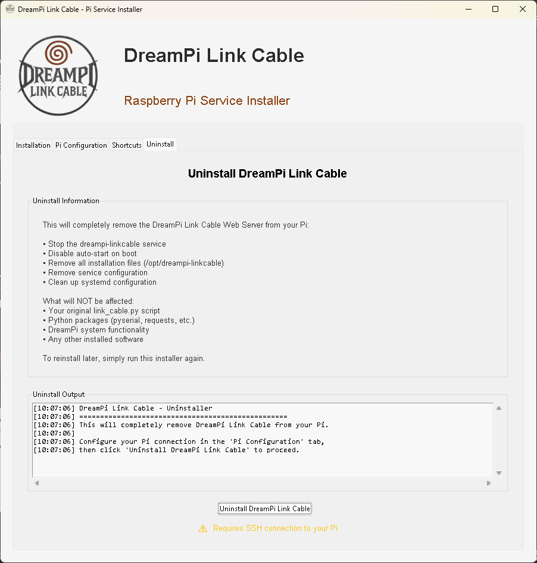

# DreamPi Link Cable Installer

A Windows application that installs and manages the DreamPi Link Cable web interface on your Raspberry Pi / DreamPi. Connects via SSH to set up the web server, create system services, and add Windows shortcuts.

## What it does

- Connects to your Pi over SSH
- Downloads and installs the DreamPi Link Cable web server
- Sets up auto-start service (dreampi-linkcable)
- Creates Windows desktop and start menu shortcuts
- Provides uninstall functionality to completely remove the service

## Requirements

- Windows 10/11
- Raspberry Pi with SSH enabled
- Network connection to your Pi
- Python and required packages on Pi (installer handles this)

## Usage

1. Download the latest release
2. Run `DreamPiLinkCableCompleteInstaller.exe`
3. Configure your Pi's connection details (hostname, username, password)
4. Test the connection
5. Click install and wait for completion
6. Use the created shortcuts to access the web interface at `http://your-pi:1999`

## Credits

This installer automates the setup of components from these projects:

DreamPi Link Cable Web Interface:
https://github.com/eaudunord/taisen-web-ui

DreamCast Taisen Netplay:
https://github.com/eaudunord/dc-taisen-netplay

More info about Taisen Netplay:
https://www.segasaturnshiro.com/2025/09/18/taisen-netplay-brings-new-ways-to-play-your-dreamcast-online/

## Thanks to eaudunord for creating the underlying DreamPi Link Cable system and web interface that this installer manages.

